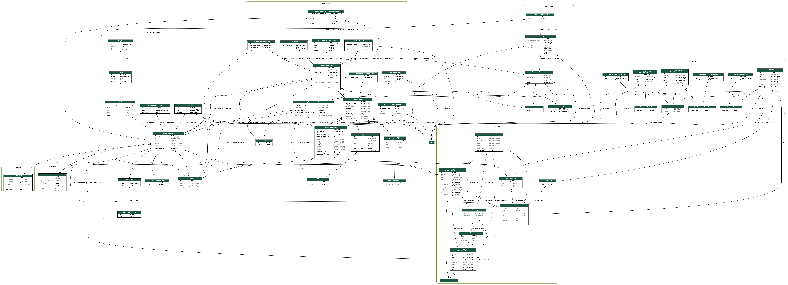

Tilavarauspalvelu-core
===================
This repository contains core of the new reservation platform for city of Helsinki.

# Installation
To run tilavarauspalvelu locally you need to have DEBUG=True in your .env file. 

Easiest way is to copy and rename .env.example to .env and make sure DEBUG=True is set. 
 
## Installation with docker

`docker-compose up`

# Running tests and formatting

Tests are run with pytest. Use `pytest` to run all tests. Use `pytest -W default` to show third party warnings ignored in `pytest.ini`.

To run static code checks and tests with coverage:

In docker

`docker-compose run dev test`

Locally:

`deploy/entrypoint.sh test`

# Environments

## Environmental variables

See [.env.example](.env.example) for environment variable documentation

## Database requirements

Postgresql 11 database with postgis extension.
 
# Authentication

Currently we use basic- or session based authentication with very basic permissions.
Everyone gets read access, write operations require authentication. 

For development purposes requirement to authenticate can be turned off by setting
environment variable TMP_PERMISSIONS_DISABLED to True.

