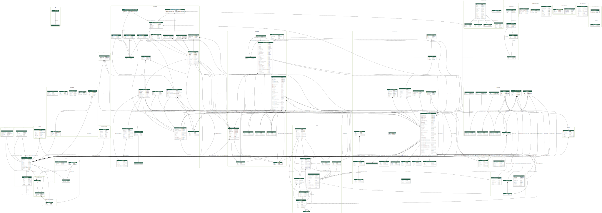

[](https://sonarcloud.io/summary/new_code?id=City-of-Helsinki_tilavarauspalvelu-core) [](https://sonarcloud.io/summary/new_code?id=City-of-Helsinki_tilavarauspalvelu-core) [](https://sonarcloud.io/summary/new_code?id=City-of-Helsinki_tilavarauspalvelu-core) [](https://sonarcloud.io/summary/new_code?id=City-of-Helsinki_tilavarauspalvelu-core) [](https://github.com/psf/black) [](LICENSE)


# Tilavarauspalvelu Core

This repository contains the backend API of the new [reservation platform](https://tilavaraus.hel.fi/) for city of Helsinki.

## Table of Contents
- [Overview](#overview)
- [Dependencies](#dependencies)
- [Setup](#setup)
- [How to run](#how-to-run)
- [Deployment](#deployment)
- [Environments](#environments)
- [Development tips and tricks](#development-tips-and-tricks)
## Overview

The main purpose of the service is to act as a backend for [tilavarauspalvelu-ui](https://github.com/City-of-Helsinki/tilavarauspalvelu-ui) and [tilavarauspalvelu-admin-ui](https://github.com/City-of-Helsinki/tilavarauspalvelu-admin-ui) through the GraphQL API.

In addition to the API, the core also handles scheduled tasks and serves as a webhook endpoint for [Helsinki city web shop](https://github.com/City-of-Helsinki/verkkokauppa-experience-api).

Project is built on the [Django](https://www.djangoproject.com/) framework, and scheduling is done with [Celery](https://github.com/celery/celery).

For more information, please refer to the [Tilavarauspalvelu](https://helsinkisolutionoffice.atlassian.net/wiki/spaces/KAN/pages/887029864/Tilavarauspalvelu+Varaamo) page in Confluence. This is also where you can find the list of [members of the project](https://helsinkisolutionoffice.atlassian.net/wiki/spaces/KAN/pages/1138065426/Tiimin+j+senet+ja+roolit). The preferred contact method is Slack.


## Dependencies
Core retrieves opening hours from [Hauki](https://github.com/City-of-Helsinki/hauki) and unit information from [Toimipaikkarekisteri](https://www.hel.fi/palvelukarttaws/restpages/ver4.html#_unit). Payments are
handled by [Helsinki Web Shop](https://github.com/City-of-Helsinki/verkkokauppa-experience-api).

From a technical standpoint, there are three main dependencies:
- [PostgreSQL 13](https://www.postgresql.org/) database with the [PostGIS](https://postgis.net/) extension for storing the data
- [Redis](https://redis.io/) for in-memory cache
- [Celery](https://github.com/celery/celery) for scheduling and background task handling

All Python dependencies can be found in [requirements.txt](requirements.txt). Separate development dependencies are listed in [requirements_dev.txt](requirements_dev.txt).

## Setup
Copy `.env.example` to `.env`:
```
cp .env.example .env
```

Make a symbolic link under `tilavarauspalvelu` directory:
```
ln -s .env tilavarauspalvelu/.env
```

Make sure that `DEBUG=True` in your `.env` file.

Create a virtual environment:
```
python -m venv venv
```

Activate the virtual environment
```
source venv/bin/activate
```

Install pip-tools:
```
pip install pip-tools
```

Install packages. This step might have issues depending on your operating system and what is
installed in it.
```
pip-sync requirements.txt requirements_dev.txt
```

You can use local instances of PostgreSQL and Redis, but the easiest way to use Docker containers:
```
docker-compose up db redis -d
```

Finally, you have to make sure settings are configured properly in `.env` file.

## How to run

### Running locally
Run migrations:
```
python manage.py migrate
```

Create an admin user if it does not exist:
```
python manage.py createsuperuser
```

Finally, start the development server:
```
python manage.py runserver 0.0.0.0:8000
```

### Running in docker (for UI devs)
Since the database takes some time to start, it is recommended to start it first and run it in the background:
```
docker-compose up db redis -d
```

Then, start the service with the following command:

```
docker-compose up backend [-d]
```

This will start the service, run database migrations, and create the initial admin user if it does not exist. The default username and password are both `admin`. using the optional `-d` flag will leave the service running in the background.


When you fetch the latest code, it is recommended to rebuild and recreate the container:
```
docker-compose up backend --build --force-recreate
```


To stop the service, use the command:
```
docker-compose stop backend
```

If you want to stop database and Redis containers as well, run:
```
docker-compose stop
```

## Deployment
CI pipelines are defined in [Azure DevOps](https://dev.azure.com/City-of-Helsinki/tilavarauspalvelu). There are two pipelines:

1. [tilavarauspalvelu-core-devtest](https://dev.azure.com/City-of-Helsinki/tilavarauspalvelu/_build?definitionId=1230) deploys the service to `development` and `test` environments every time a pull request is merged into the main branch. Deployment to `test` environment requires manual approval.

2. [tilavarauspalvelu-core-stageprod](https://dev.azure.com/City-of-Helsinki/tilavarauspalvelu/_build?definitionId=1231) deploys the service to `staging` and `production` environments. Manual approval is required for both.

For `staging` and `production` releases:
1. Bump the `__version__` in [tilavarauspalvelu/__init__.py](tilavarauspalvelu/__init__.py)
2. Create a new [tag](https://github.com/City-of-Helsinki/tilavarauspalvelu-core/tags) that matches the version, for example, `release-0.21.0`.

Environment configurations for each environment are defined in the [library](https://dev.azure.com/City-of-Helsinki/tilavarauspalvelu/_library?itemType=VariableGroups).

## Environments
The service is managed via Red Hat OpenShift. Management UIs:
- [Development and Test environment](https://console-openshift-console.apps.arodevtest.hel.fi/topology/ns/hki-kanslia-aok-tilavarauspalvelu-test)
- [Staging and Production environment](https://console-openshift-console.apps.platta.hel.fi/add/all-namespaces) (requires [Helsinki VPN](https://huolto.hel.fi/))

The four environments are the following:
- `dev`: runs the latests merged code
- `test`: used for approval testing
- `staging`: used to verify the release
- `production`: final product for the end users

## Development tips and tricks


### Running tests, linters and formatting
Running tests locally requires that the PostgreSQL database, Redis cache and ElasticSearch are up and running. You can start them with
`docker-compose up -d db redis elastic`.

To run all tests with verbose output, you can simply run `pytest`. To ignore third-party warnings, you can run `pytest -W default`. Not that some unit tests may take longer to run. If you want to ignore the slow tests, run `SKIP_LONG_RUNNING=1 pytest -W default`.

If you'd like the unittests not to mess up your development environment use local_settings to make own search index for test database. Like:
```
env = Env(TEST=(bool, False))

if env("TEST"):
    settings.DATABASES["default"]["NAME"] = "test_tvp"
    SEARCH_SETTINGS = {
        "connections": {
            "default": env("ELASTICSEARCH_URL"),
        },
        "indexes": {
            "test_reservation_units": {
                "models": [
                    "reservation_units.ReservationUnit",
                ]
            }
        },
        "settings": {
            "chunk_size": 500,
            "page_size": 10000,
            "auto_sync": True,
            "never_auto_sync": [],
            "strict_validation": False,
            "mappings_dir": "elastic_django/tests/mappings",
        },
    }
```
So the above settings expects that there would be environment variable  TEST present and the mappings files has then the test_reservation_units.json.
You could then run the tests like: `TEST=True pytest`.

Linters and auto-formatting can be run with the `./format.sh` script found in the project root. It runs [black](https://github.com/psf/black), [isort](https://pycqa.github.io/isort/), and [flake8](https://github.com/pycqa/flake8).

### Running background processing (Celery)

Background processes are run with [Celery](https://docs.celeryproject.org/).

If you want to run background processes synchronously without Celery, 
set the environment variable `CELERY_ENABLED` to `false`.

When developing locally without Docker, you need to manually run the Celery worker
by executing `celery -A tilavarauspalvelu worker --beat --loglevel info --scheduler django` in the project root if you want to run background jobs with Celery.

In development environments, the file system backend is easiest to use (the current default).
You need to create a queue and processed folders and update the environment variables 
CELERY_QUEUE_FOLDER_OUT, CELERY_QUEUE_FOLDER_IN, CELERY_PROCESSED_FOLDER to match.
The default values are ./broker/queue/ for in and out, and ./broker/processed/ for processed. 


### Upgrading Python packages
[pip-tools](https://github.com/jazzband/pip-tools) is used to manage packages. To make changes to packages or versions, edit [requirements.in](requirements.in) and [requirements_dev.in](requirements_dev.in) files. Avoid pinning the versions unless it is absolutely necessary.

After making the changes, you can generate the `.txt` files:
```
pip-compile requirements.in
pip-compile requirements_dev.in
```

The generated `requirements.txt` and `requirements_dev.txt` files contain fully tested, pinned versions of the requirements.

To update your virtual environment, you can use `pip-sync` command:
```
pip-sync requirements.txt requirements_dev.txt
```

If you need to upgrade individual packages, you can use `--upgrade-package` argument:
```
pip-compile requirements.in --upgrade-package [PACKAGE_NAME]
```

### Authentication

We use Tunnistamo and JWT tokens for API authentication. Support for Tunnistamo authentication is implemented by django-helusers library. Following env variables must be set for authentication to work properly:

- TUNNISTAMO_JWT_AUDIENCE - Client ID of tunnistamo client for API. By default `https://api.hel.fi/auth/tilavarausapidev`
- TUNNISTAMO_JWT_ISSUER - Issuer of the JWT token. By default `https://tunnistamo.test.hel.ninja/openid`.
- TUNNISTAMO_ADMIN_KEY - Tunnistamo client ID for Django Admin. By default `tilanvaraus-django-admin-dev`.
- TUNNISTAMO_ADMIN_SECRET - Secret for the same tunnistamo client for Django Admin. There is no default. Get this value from Tilavarauspalvelu backend developers.
- TUNNISTAMO_ADMIN_OIDC_ENDPOINT - OIDC endpoint of the SSO provider. By default `https://tunnistamo.test.hel.ninja/openid`.

Each UI has implemented Tunnistamo login which will provide UI with JWT token for API. The token is used for 

In debug mode basic and session authentication are also enabled.

There is a **known issue**, where separate user objects are created for JWT and Django Admin authentications. This is not intended and will probably be fixed at some point.

### Static files

Contrary to more common set-ups, this application does not have a reverse proxy serving static files. Instead, static files are served by both Django and uwsgi.

Static files are served by the [Whitenoise](https://whitenoise.evans.io/en/stable/) package. These are all files that are not uploaded by the users in Django Admin pages.

Media files are served by the [uwsgi static files implementation](https://uwsgi-docs.readthedocs.io/en/latest/StaticFiles.html) offloaded to threads. These are all files uploaded by users in Django Admin pages. If there are performance issues (I.E. 502 errors from the Application Gateway) it is very likely process count and or process scale-up must be tweaked higher.

### Performance testing and optimization

To debug REST API endpoints, the [Django debug toolbar](https://django-debug-toolbar.readthedocs.io/en/latest/) package can be used. The debug toolbar will gather information of code execution and database interactions with which it is possible to optimize both code and query usage. A similar package is available for GraphQL endpoint optimization, the [Django GraphQL Debug Toolbar](https://github.com/flavors/django-graphiql-debug-toolbar). These are not currently installed in the project. When optimization is done, these must be installed first before proceeding to the next steps.

#### Django Debug Toolbar
To set-up django debug toolbar, these settings are needed.

```py
# Hardcode to internal IPs as debug toolbar will expose internal information
INTERNAL_IPS = ["127.0.0.1", "localhost"]
INSTALLED_APPS.append("debug_toolbar")

# According to documentation, this should be as early as possible in the middleware tree
MIDDLEWARE.insert(0, "debug_toolbar.middleware.DebugToolbarMiddleware")
```

Also, add the following line to the end of the tilavarauspalvelu [urls.py](./api/urls.py) file:

```py
urlpatterns += [path("__debug__/", include("debug_toolbar.urls"))]
```

Do not add these changes to [settings.py](./tilavarauspalvelu/settings.py). Use `local_settings.py` instead so that the changes are applied to your dev environment only. When above lines are added bottom of the file, the debug toolbar will be visible when a REST API endpoint is loaded in any browser.

#### GraphQL Debug Toolbar
To set-up Django GraphQL debug toolbar, copy the following lines of code to the end of `local_settings.py`. Please make sure to remove all "debug toolbar" related lines first as they do not work together! Yes, the lines below are correct, debug_toolbar must be in installed apps but its middleware cannot be added.

```py
# Hardcode to internal IPs as debug toolbar will expose internal information
INTERNAL_IPS = ["127.0.0.1", "localhost"]

# Graphene debug settings
GRAPHENE["MIDDLEWARE"] += ["graphene_django.debug.DjangoDebugMiddleware"]

INSTALLED_APPS.append("debug_toolbar")
INSTALLED_APPS.append("graphiql_debug_toolbar")

# According to documentation, this should be as early as possible in the middleware tree
MIDDLEWARE.insert(0, "graphiql_debug_toolbar.middleware.DebugToolbarMiddleware")
```

Also, add the following line to the end of the "tilavarauspalvelu" [urls.py](./api/urls.py) file:

```py
urlpatterns += [path("__debug__/", include("debug_toolbar.urls"))]
```

When the lines above have been added and the server has been re-/started, the django debug toolbar will load in `/graphql/` endpoint.

### Data model visualization


### Known setup issues

#### Psycopg2 issue
You might get an error when installing psycopg2. To fix the issue, you need to install OpenSSL and then update the LIBRARY_PATH env:
```
brew install openssl
export LIBRARY_PATH=$LIBRARY_PATH:/usr/local/opt/openssl/lib/
```

#### OR-Tools issue
At the time of writing this, OR-Tools only supports x86_64/amd64 architecture so it does not work on M1 Macs. On M1 Macs you'll get an error when you try install `requirements.txt`.

To solve the issues, follow [this guide](https://dev.to/yulin/how-to-install-google-or-tools-on-apple-m1-arm64-346b). Just remember to install Python 3.8 instead of the latest version available:

```
brew86 install python@3.8
```
